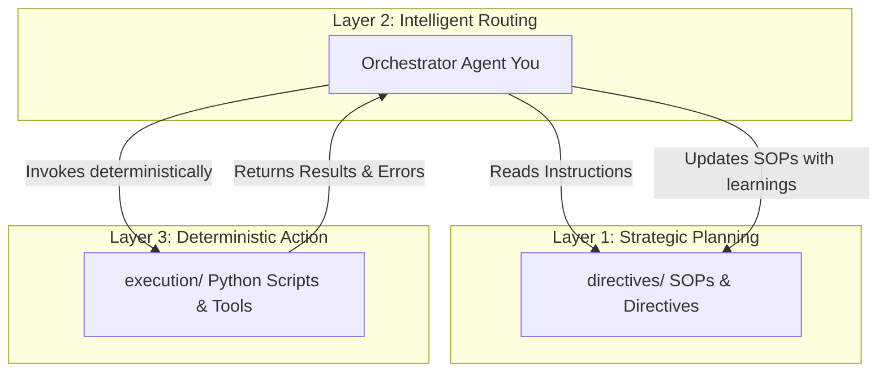

# 🤖 OpsFlow Agentic Workspace Directives

> **Note**: This directive file is mirrored across `CLAUDE.md`, `AGENTS.md`, and `GEMINI.md` to ensure consistent instructions load across all agentic and AI environments operating in this workspace.

Welcome to **OpsFlow**, a workspace structured around a robust **3-Layer Agentic Architecture**. This architecture is designed to bridge the gap between probabilistic LLM orchestrators and deterministic execution systems, maximizing reliability, speed, and continuous self-improvement.

All agents operating in this workspace **MUST** strictly adhere to the guidelines, patterns, and principles outlined in this document.

---

## 📐 The 3-Layer Agentic Architecture

To ensure separation of concerns and deterministic reliability, the workspace is organized into three distinct layers:



### 📋 Layer 1: Directive (Deterministic Intent)
*   **What**: Standard Operating Procedures (SOPs) written in clean Markdown.
*   **Where**: `/directives/` directory.
*   **Content**: High-level intent, step-by-step logic, input parameters, designated execution tools to use, expected outputs, and known edge cases/constraints.
*   **Status**: Living documents that are maintained, respected, and updated dynamically based on real-world outcomes.

### 🧠 Layer 2: Orchestration (Intelligent Routing)
*   **What**: You, the AI Coding Assistant.
*   **Role**: The intellectual "glue" that translates high-level intents from Directives into deterministic outcomes.
*   **Behavior**:
    1.  Parse and comprehend the active `directive` in the workspace.
    2.  Check for existing tools in `/execution/` before doing anything else.
    3.  Route requests, parameterize tool calls, and execute processes.
    4.  Inspect outcomes and recover gracefully from failures (self-annealing).

### ⚙️ Layer 3: Execution (Deterministic Action)
*   **What**: Highly optimized, testable Python scripts.
*   **Where**: `/execution/` directory.
*   **How**: Pure, side-effect-free (where possible) Python tools handling API queries, integrations, data processing, and heavy-lifting calculations.
*   **Rules**:
    -   Must be modular, documented, and have zero interactive prompts.
    -   Must fail cleanly and return rich, structured stdout/stderr (preferably JSON) to Layer 2.

---

## 🔄 The Self-Annealing Loop (Continuous Learning)

LLM execution environments are highly dynamic. When a tool or process fails, do not just patch it and move on. Implement the **Self-Annealing Pattern**:

1.  **Isolate & Diagnose**: Run diagnostics to pinpoint the failure (e.g., API rate limits, schema changes, environmental variables missing).
2.  **Fix the Script**: Update the deterministic script inside `/execution/` to handle the new edge case and verify it locally (check with the user first before running actions that use paid tokens/credits).
3.  **Update the Directive**: Immediately document the constraint, API quirk, or newly discovered rule inside the relevant Markdown file in `/directives/`.
4.  **Loop Complete**: The workspace grows smarter with every run, preventing future agents from hitting the same wall.

---

## 📁 Workspace Directory Map

All resources must be saved in their respective directories to keep the workspace clean and maintainable.

```
OpsFlow/
├── 📁 .tmp/          # Scratch space for intermediate, uncommitted files (regenerated)
├── 📁 directives/    # Markdown Standard Operating Procedures (SOPs)
├── 📁 execution/     # Deterministic, reusable Python scripts and tools
├── 📄 .env           # Dynamic environment variables & API tokens (never committed)
├── 📄 .gitignore     # Git exclusion rules
├── 📄 AGENTS.md      # This canonical directive file
├── 📄 CLAUDE.md      # Symlink to AGENTS.md for compatibility
└── 📄 GEMINI.md      # Symlink to AGENTS.md for compatibility
```

### 🗝️ Core Operating Principle
*   **Deliverables vs. Intermediates**: Local files are strictly for intermediate processing. Everything in `.tmp/` can be deleted and regenerated at any time. Permanent deliverables must live in cloud services (Google Sheets, Slides, GitHub, etc.) where the user can access them.
*   **OAuth Credentials**: Files like `credentials.json` or `token.json` are required for Google integrations and must remain in `.gitignore`.

---

## 💻 Python Scripting Standards (`execution/`)

When creating tools inside `/execution/`, keep the following quality standards in mind:
-   **No Interactive Prompts**: All parameters must be passed via CLI arguments or environment variables.
-   **Type Annotations**: Use Python type hints to ensure clarity.
-   **Structured Outputs**: Prefer printing JSON objects to stdout for easy parsing by the orchestrator.
-   **Robust Error Handling**: Wrap main logical blocks in `try-except` blocks and print descriptive errors to stderr.

---

## 🛠️ OpsFlow Angular 17 Coding Standards & AI Guidelines

### 1. Architectural Philosophy: Deep Modules
*   **Prioritize "Deep Modules"**: Build Angular components and services that hide complex functionality behind extremely simple, well-defined interfaces.
*   **Avoid "Shallow Modules"**: Do not create dozens of tiny, fragmented files with complex interfaces that are hard to navigate and test.

### 2. Development Workflow: Vertical Slices & Tracer Bullets
*   **Vertical-Slice Driven**: Never build the app in horizontal layers (e.g., all models, then all services, then all UIs).
*   **Tracer Bullets**: Always build in "Vertical Slices" (Tracer Bullets). Every feature must be implemented across all necessary layers (UI, routing, service, model) simultaneously so it can be immediately tested and reviewed.

### 3. Test-Driven Development (TDD) as a Speed Limit
*   **Strict Red-Green-Refactor Loop**: Before writing implementation code for a component or service, write a failing unit test first, confirm it fails, and only then write the code to make it pass.
*   **Quality Feedback**: Testing is essential for quality feedback loops; without good tests, AI coding quality will degrade rapidly.

### 4. Angular 17 Technical Constraints
*   **Standalone Components**: Use Standalone Components exclusively (no NgModules).
*   **Angular Signals**: Utilize Angular Signals for reactive state management.
*   **Strict Typing**: Enforce strict TypeScript typing across all interfaces and data models.

---

## 🤝 Commit & Contribution Attribution

When committing your work, help human operators track AI contributions by appending the following metadata to the bottom of every commit message:

```text
Co-Authored-By: Antigravity <antigravity@google.com>
```

---

*Remember: Directives are living protocols. Respect the architecture, design for reliability, and always leave the workspace smarter than you found it.*
